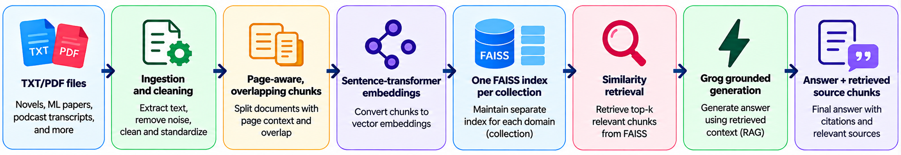

---
[](https://multi-domain-rag-assistant.streamlit.app/)
## Multi-Domain-RAG-Assistant
A local Streamlit application for asking grounded questions over separate
document collections. The user selects one knowledge base, the application
retrieves relevant chunks from that collection, and Groq generates an answer
using only the retrieved evidence.

The project is designed as a practical, explainable RAG pipeline rather than a
single mixed document index.

## Knowledge bases

The application provides four independent collections:

- 📚 **Novel** - books and other literary documents
- 📝 **ML Papers** - machine-learning research papers and technical PDFs
- ♫₊˚ **Podcast Transcripts** - podcast transcripts and related discussion documents
- 📓 **Others** - any TXT or PDF documents that do not fit the other categories

Documents from one collection are never searched when another collection is
selected. This keeps answers scoped to the user's chosen knowledge base.

## System Pipeline



### Ingestion and chunking

--
`src/ingest.py` supports TXT and PDF files.

- PDF text is processed page by page.
- Text is cleaned before splitting.
- Chunks use a recursive, semantically aware splitter when available.
- Default chunk size is **700 characters**.
- Default overlap is **120 characters**.
- Every PDF chunk records its source page.
- Chunk IDs are unique within each source document.
- Larger documents naturally produce more chunks than smaller documents.

Chunk output is written to:

```text
outputs/<collection>_chunks.json
```

### Embeddings and vector stores

The project uses the `all-MiniLM-L6-v2` sentence-transformer model to create
normalized dense embeddings. FAISS stores one vector index for each collection:

```text
faiss_index/novel/
faiss_index/ml_papers/
faiss_index/podcast_transcripts/
faiss_index/others/
```

The `faiss_index/` directory is generated locally and is ignored by Git.

### Retrieval

The selected collection is searched with vector similarity. Retrieval is
calculated from the number of indexed chunks, with a practical maximum of 24
chunks. You can override the automatic value with:

```env
RAG_TOP_K=10
```

The UI displays the retrieved source file, chunk ID, page number when
available, similarity score, and chunk text.

### Generation model

Groq is the only generation provider in this project.

Default model:

```text
openai/gpt-oss-120b
```

The model receives the user's question and the retrieved context. The prompt
instructs it to:

- stay grounded in the selected collection
- provide a complete answer when the evidence supports one
- include important details and caveats
- label cautious synthesis as an inference
- avoid using outside knowledge
- say when the documents do not contain enough information

You can select another model available in your Groq account with:

```env
GROQ_MODEL=your_groq_model_name
```

## Project structure

```text
.
├── app.py                         # Streamlit user interface
├── data/
│   ├── novel/                     # Novel documents
│   ├── ml_papers/                 # ML paper documents
│   ├── podcast_transcripts/       # Transcript documents
│   └── others/                    # General-purpose document collection
├── outputs/                       # Generated chunk JSON files
├── src/
│   ├── ingest.py                  # Loading, cleaning, and chunking
│   ├── embed_store.py             # Embeddings and FAISS indexes
│   ├── rag_chain.py               # Retrieval and Groq generation
│   └── evaluate.py                # Ragas evaluation workflow
├── .env.example                   # Safe environment template
├── .gitignore
├── requirements.txt
└── README.md
```

## Installation

Use Python 3.10 or newer.

```bash
python -m venv .venv
```

Windows PowerShell:

```powershell
.venv\Scripts\Activate.ps1
pip install -r requirements.txt
```

macOS/Linux:

```bash
source .venv/bin/activate
pip install -r requirements.txt
```

## Configuration

Copy the example environment file:

```powershell
Copy-Item .env.example .env
```

Add your Groq API key to `.env`:

```env
GROQ_API_KEY=your_groq_api_key_here
GROQ_MODEL=openai/gpt-oss-120b
```

Optional settings:

```env
# Override automatic retrieval sizing.
RAG_TOP_K=10

# Maximum generated response tokens.
RAG_MAX_TOKENS=2500
```

Never commit `.env` or an actual API key. `.env` is ignored by Git and
`.env.example` contains only placeholders.

## Build the data pipeline

After adding or replacing documents, run:

```powershell
python src\ingest.py
python src\embed_store.py
```

`Others` may be empty in a fresh checkout. Its empty index is skipped during a
full rebuild and is created automatically after the first document is uploaded
or added to `data/others/`.

## Run the application

```powershell
streamlit run app.py
```

Open the local URL shown by Streamlit, usually:

```text
http://127.0.0.1:8501
```

Select a knowledge base, ask a question, and expand **View retrieved chunks**
to inspect the evidence used for the answer.

## Adding documents

There are two supported workflows.

### Add files manually

Copy TXT or PDF files into one of these directories:

```text
data/novel/
data/ml_papers/
data/podcast_transcripts/
data/others/
```

Then rebuild:

```powershell
python src\ingest.py
python src\embed_store.py
```

### Upload through the UI

1. Select the target knowledge base.
2. Open **Upload documents to this knowledge base**.
3. Select one or more TXT or PDF files.
4. Choose **Add documents and rebuild index**.

The selected collection is re-ingested and its index is rebuilt.

## Evaluation

The evaluation script runs the sample novel question set and writes a CSV
result:

```powershell
python src\evaluate.py
```

The output is written to:

```text
outputs/eval_results.csv
```

Evaluation requires the optional Ragas-related dependencies listed in
`requirements.txt` and a working Groq API key.

## Validation performed

The current pipeline has been smoke-tested across all four collection names
and the three populated sample collections:

| Collection | Sample status |
|---|---|
| Novel | Retrieval and answer generation verified |
| ML Papers | Retrieval and answer generation verified |
| Podcast Transcripts | Retrieval and answer generation verified |
| Others | Empty collection handled safely; ready for uploads |

The application also validates that:

- ingestion works when launched outside the project directory
- PDF page metadata is preserved
- generated indexes can be loaded by the RAG chain
- empty `Others` does not break a full index rebuild
- no API key is stored in `.env.example`

## Limitations

- Answer quality depends on the quality and completeness of the documents.
- Scanned PDFs without a text layer may need OCR before ingestion.
- The bundled ML paper is a small placeholder document; a real multi-page paper
  will create more page-aware chunks.
- FAISS indexes are generated artifacts and must be rebuilt when source files
  change.
- The application requires a Groq API key for full model-generated answers.


## Future work

The next improvements would be:

- Add hybrid search and reranking for better retrieval quality.
- Add OCR and richer parsing for scanned PDFs and tables.
- Add inline citations linked to source files and page numbers.
- Add automated tests and evaluation for all four knowledge bases.
- Move indexing to a persistent vector database for larger deployments.
